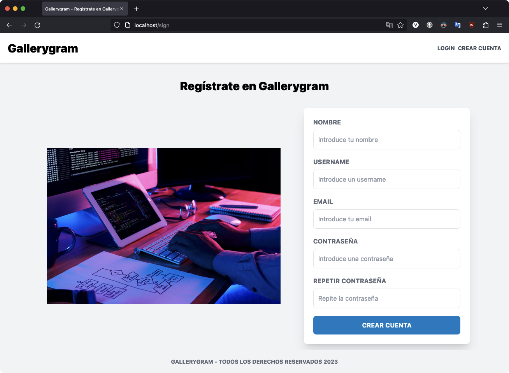
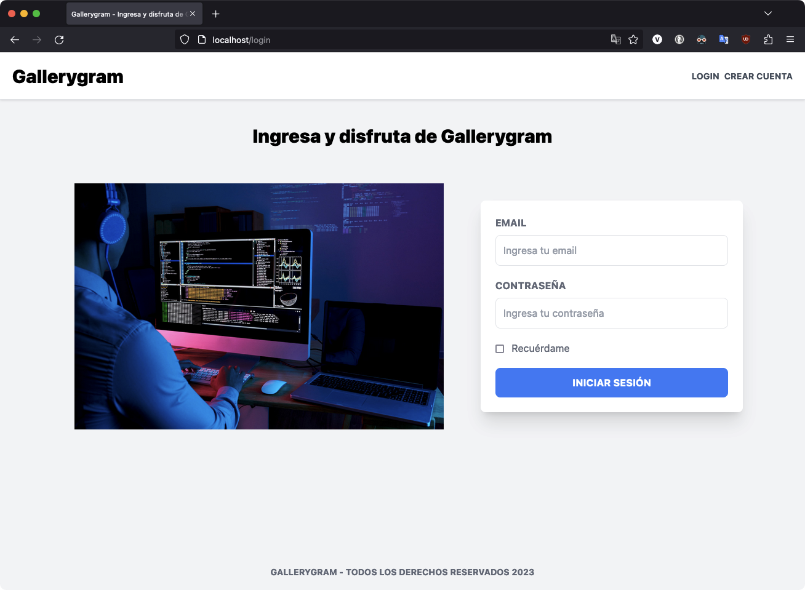
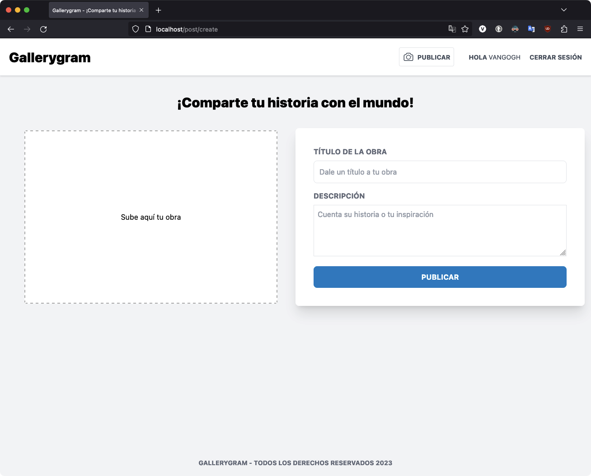
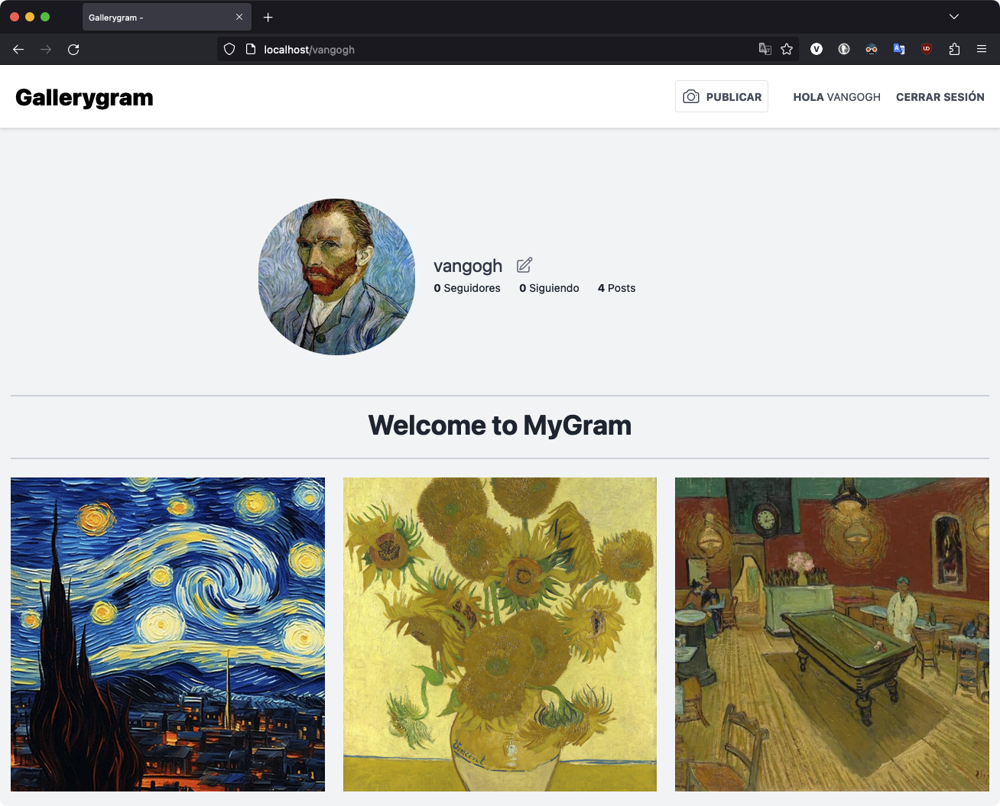
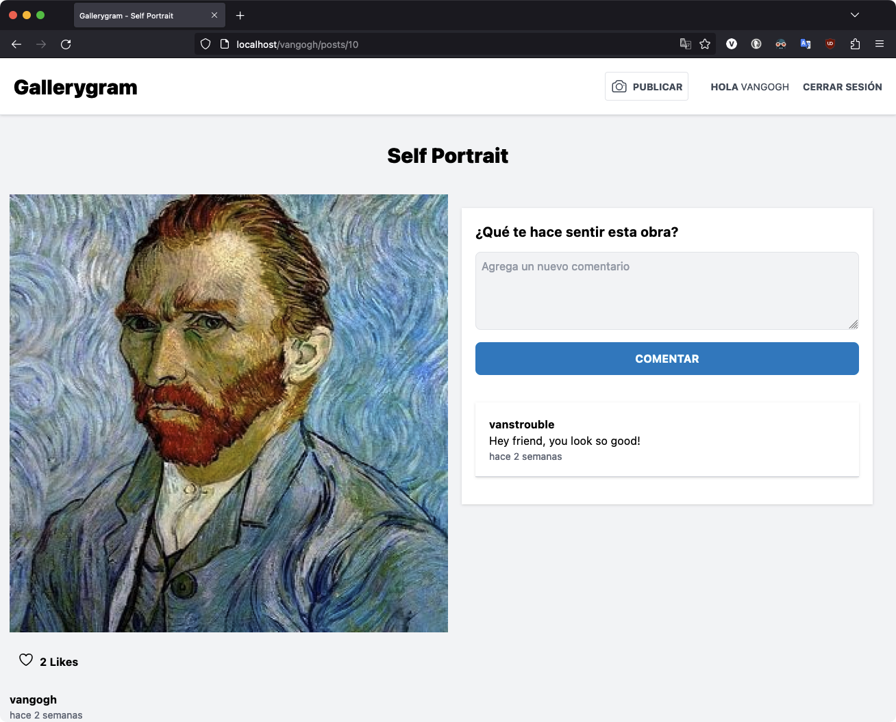

# Gallerygram | Digital Art Museum
Welcome to Gallerygram, the digital art museum where you can showcase your masterpieces to the world and share the inspiration behind each piece! Gallerygram is a basic clone of VSCO and Instagram, but with an exclusive focus on artwork and creative expression.
## Outstanding features:
**Create your profile and access safely:**
Gallerygram allows you to create a personalized profile with encrypted passwords to ensure the safety of your personal data and artistic creations.

**Upload and share your digital art:**
Upload your digital art images to the virtual museum and share them with the creative community. Each piece of art features a title and description that allows you to tell the story and inspiration behind each piece.

**Explore artist profiles:**
Discover talented artists from around the world by visiting their profiles. Look at their profile picture, number of followers, and total posts made to get to know the creators behind the artwork better.

**Like and share your appreciation:**
Express yourself and show your support for other artists by liking their posts. Gallerygram allows you to interact with the creative community and build a network of mutual support.

---
### Used tools
**[Laravel (PHP):](https://laravel.com)**
Gallerygram has been developed using the powerful PHP framework, Laravel, which offers a solid framework and a reliable foundation for web development.

**[Tailwind CSS:](https://tailwindcss.com)**
Gallerygram's sleek and modern interface has been designed using TailwindCSS, a CSS framework that provides customizable components and a wide variety of predefined styles.

**[Heroicons:](https://heroicons.com)**
To improve the design and user experience, Heroicons have been used, providing a library of high-quality and attractive icons.

**[Dropzone:](https://www.dropzone.dev)**
Gallerygram incorporates Dropzone, a JavaScript library to make uploading images intuitive and fast.

**[Intervention Image:]((https://image.intervention.io/v2))**
To guarantee the quality and optimization of the art images, Intervention Image, a PHP library for image manipulation, has been used.

---
Gallerygram is the perfect place for digital artists and art lovers who want to share their work and connect with a passionate community. Join us and let your artwork come to life in this exciting digital art museum!
